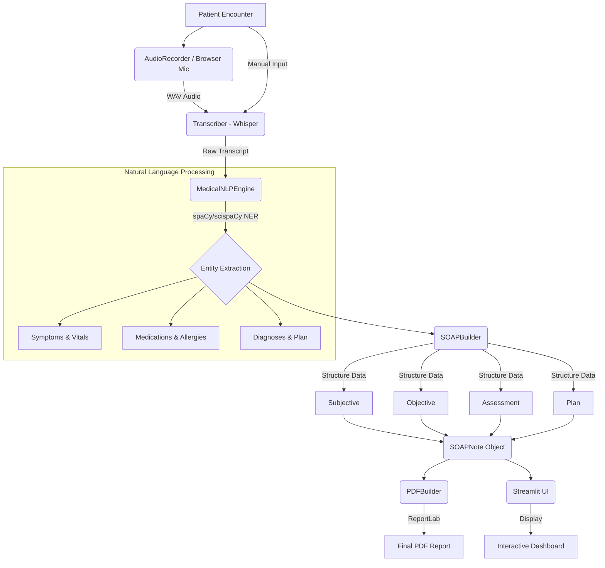

# MedScribe - Clinical Documentation System

MedScribe is an AI-powered, fully local clinical documentation system that records doctor-patient interactions and processes them into comprehensive SOAP (Subjective, Objective, Assessment, Plan) reports.

## System Overview

MedScribe operates completely locally, ensuring patient data remains secure (no API keys or internet required). It features a robust pipeline that:
1. Records audio of the encounter locally.
2. Transcribes the audio using OpenAI's Whisper model.
3. Analyzes the transcript to extract structured medical entities (symptoms, medications, vitals, diagnoses) using a custom natural language processing (NLP) engine backed by spaCy/scispaCy.
4. Generates a formatted clinical SOAP note along with associated clinical alerts, warnings, and differentials.
5. Exports the structured SOAP note into a professional, print-ready PDF report.

Additionally, MedScribe provides a beautiful Streamlit-based web interface to manage patient data, record encounters directly from the browser, manually paste transcripts, and view the generated reports interactively.

## Workflow Integration

The overall data flow from consultation to finalized report is shown below:



## Component Breakdown

- **`app.py`**: The main Streamlit web application. It handles user input for patient demographics, provides options for audio recording, file upload, or text pasting, and renders the structured SOAP note and PDF download interactively.
- **`main.py`**: A CLI entry point for running the generation pipeline in the terminal (`recording` or `text` mode) with a rich console interface.
- **`recorder.py`**: Handles local microphone audio recording via `sounddevice`, saving the output as `.wav` files.
- **`transcriber.py`**: Wraps the OpenAI Whisper library for local transcription of `.wav` files. Has a fallback to manual entry if Whisper is not installed.
- **`nlp_engine.py`**: The core rule-based and machine-learning extraction engine. Utilizes `spaCy` (specifically scientific models if available) coupled with colloquial-to-clinical regex lexicons to extract medical entities accurately and reliably determine symptom negation, vitals, medications, and diagnoses.
- **`soap_builder.py`**: Structures the extracted `ClinicalEntities` into a standardized `SOAPNote` object. It includes intelligent business logic for flagging critical vitals or high-risk medications.
- **`pdf_builder.py`**: Uses `ReportLab` to construct a beautifully formatted, print-ready PDF from the generated `SOAPNote`, complete with clinical alerts, physical exam placeholders, and formatted text blocks.

## Setup and Installation

### Local Installation

1. Create a virtual environment and attach it:
   ```bash
   python -m venv meds_env
   source meds_env/bin/activate  # On Windows: meds_env\Scripts\activate
   ```
2. Install the required dependencies:
   ```bash
   pip install -r requirements.txt
   pip install openai-whisper
   ```
   *Note: For audio recording locally, ensure you have PyAudio or `portaudio` drivers installed.*
3. Install the spaCy model (optional but recommended for better NLP):
   ```bash
   pip install https://s3-us-west-2.amazonaws.com/ai2-s2-scispacy/releases/v0.5.1/en_core_sci_sm-0.5.1.tar.gz
   ```
4. Run the Streamlit interface:
   ```bash
   streamlit run app.py
   ```
   Or run the interactive CLI interface:
   ```bash
   python main.py
   ```

### Running with Docker

MedScribe includes a Dockerized setup running the Streamlit app and a local Ollama service for advanced LLM fallback (if enabled by environment). 

To spin up the system using Docker:

1. Ensure Docker and Docker Compose are installed on your system.
2. Run the following command from the root of the project:
   ```bash
   docker-compose up -d --build
   ```
3. The Streamlit application will be available at `http://localhost:8501`.
4. (Optional) Ollama is exposed on port `11434` as configured in `docker-compose.yml` for local LLM routing.

To stop the services, run:
```bash
docker-compose down
```
